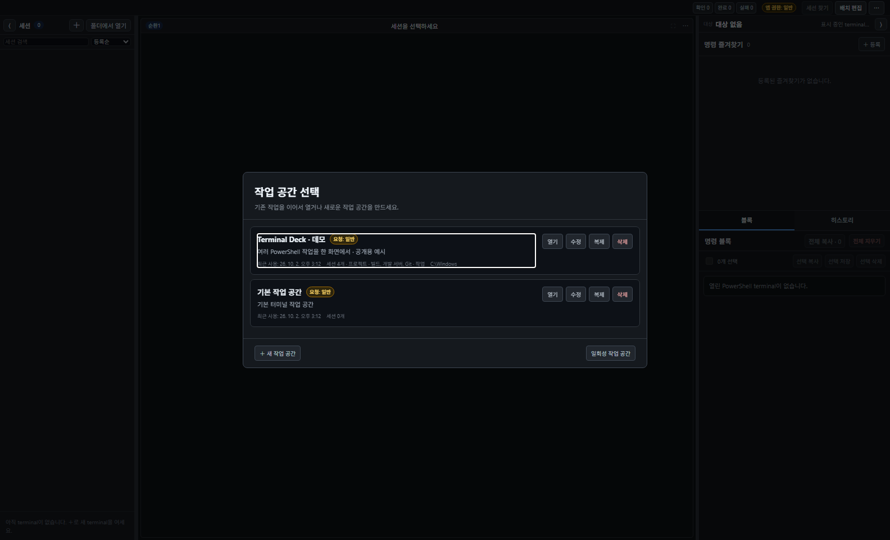
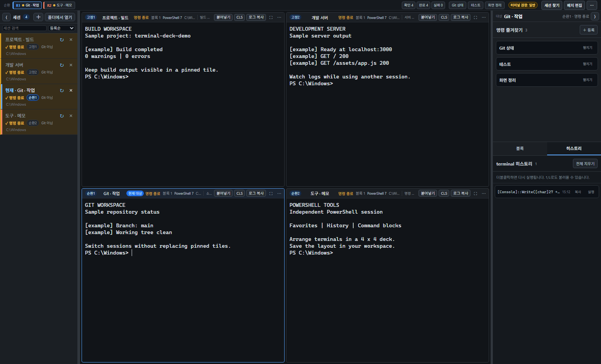
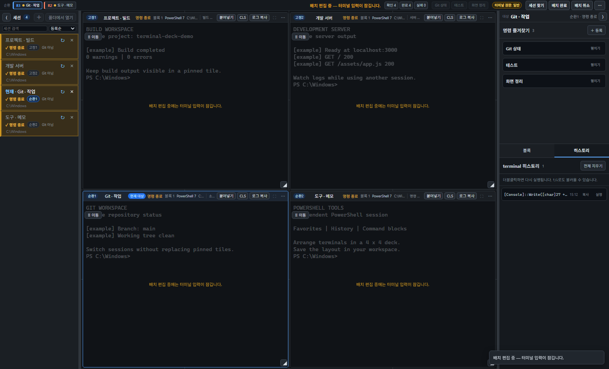

# Terminal Deck 사용자 매뉴얼

Windows에서 여러 PowerShell 세션을 한 창에 배치하고, 작업 공간별로 세션 구성과 배치를 저장하는 터미널 앱입니다.

- 대상 버전: **0.10.1**
- [설치 파일·ZIP 다운로드](https://github.com/nothing2that-sys/terminal_deck/releases/tag/v0.10.1)
- [최신 Release](https://github.com/nothing2that-sys/terminal_deck/releases/latest)
- [GitHub 저장소](https://github.com/nothing2that-sys/terminal_deck)
- [문제 제보](https://github.com/nothing2that-sys/terminal_deck/issues)
- 라이선스: MIT

## 1. 설치와 첫 실행

Windows 10 1809 이상, Windows x64 환경에서 사용합니다. PowerShell 7을 권장하며, 없으면 Windows PowerShell 5.1을 사용합니다. 배포 파일을 사용할 때는 Node.js를 설치할 필요가 없습니다.

| 다운로드 파일 | 사용 방법 |
|---|---|
| `TerminalDeck-Setup.exe` | 실행하여 현재 사용자 계정에 설치합니다. 바로가기 생성 여부를 묻는 화면이 나오면 원하는 항목을 선택합니다. |
| `terminal-deck-0.10.1-win32-x64.zip` | 전체 압축을 풀고 폴더 안의 `TerminalDeck.exe`를 실행합니다. EXE만 따로 옮기지 마세요. |
| `SHA256SUMS.txt` | 다운로드 파일의 SHA-256 확인용입니다. |

배포 파일에는 코드 서명이 없습니다. 다운로드 출처와 해시를 확인하세요. Windows의 실행 차단 정책을 바꾸어야 하는 경우에는 본인의 조직 정책을 따릅니다.

해시를 확인하려면 다운로드 폴더에서 다음 명령을 실행하고 `SHA256SUMS.txt`의 해당 파일 값과 비교합니다.

```powershell
Get-FileHash .\TerminalDeck-Setup.exe -Algorithm SHA256
```

처음 실행하면 **작업 공간 선택** 화면이 표시됩니다. `＋ 새 작업 공간`으로 이름과 설명을 입력해 저장한 뒤 `열기`를 누릅니다. 저장된 구성이 필요 없는 작업은 `일회성 작업 공간`으로 시작할 수 있습니다.



## 2. 5분 안에 시작하기

1. 작업 공간을 열고 왼쪽 세션 목록의 `＋`를 눌러 PowerShell 세션을 만듭니다.
2. 시작 폴더를 직접 고르려면 `폴더에서 열기`를 사용합니다.
3. 왼쪽 목록에서 세션을 선택하고, 가운데 터미널에 명령을 입력합니다.
4. 계속 보려는 세션은 목록의 오른쪽 클릭 메뉴에서 고정 타일에 배치합니다.
5. `배치 편집`에서 타일 위치와 크기를 조절한 뒤 `배치 완료`를 누릅니다.
6. 오른쪽 `명령 즐겨찾기`의 `＋ 등록`으로 자주 쓰는 명령을 저장합니다.

앱을 다시 열면 저장된 세션 이름·시작 폴더·배치·히스토리를 복원합니다. 이전 PowerShell 프로세스나 실행 중이던 서버·명령을 이어 붙이는 방식은 아닙니다. 세션은 새 PowerShell 프로세스로 시작하므로 필요한 서버나 작업은 다시 실행하세요.

## 3. 화면 읽기



| 영역 | 하는 일 |
|---|---|
| 왼쪽 세션 목록 | 세션 추가·선택·검색·정렬·이름 변경·배치 지정·삭제 |
| 가운데 Session Deck | 여러 터미널을 고정/순환 타일로 표시 |
| 오른쪽 도구 패널 | 현재 대상 세션의 즐겨찾기 실행, 명령 블록과 히스토리 확인 |
| 상단 | 순환 세션 빠른 전환, 완료/실패 확인, 즐겨찾기, 세션 찾기, 배치 편집, 설정·진단 |

파란 `현재 대상` 타일과 왼쪽 선택 행, 오른쪽 `대상` 이름은 같은 세션을 가리킵니다. 키보드 입력은 포커스된 터미널로 들어갑니다. 즐겨찾기를 실행하기 전에는 오른쪽 대상 이름을 확인하세요.

위 이미지들은 **별도의 공개용 데모 작업 공간에서 실제 앱과 실제 PowerShell 세션을 실행해 캡처**했습니다. 터미널의 `[example]` 출력은 기능 설명용 예시이며, 실제 프로젝트의 빌드·서버·Git 결과가 아닙니다.

## 4. 작업 공간 관리

- **새 작업 공간:** 세션 목록·타일 배치·명령 히스토리를 작업 단위로 나눕니다.
- **수정:** 선택 화면의 `수정`으로 이름·설명·관리자 권한 요청을 변경합니다.
- **복제:** 세션 구성과 배치를 복사합니다. 명령 히스토리와 provider 연결 정보는 복사하지 않습니다.
- **삭제:** 해당 작업 공간과 저장된 세션 히스토리를 지웁니다. 공용 즐겨찾기와 설정은 유지됩니다. 실행 중인 작업 공간은 삭제할 수 없습니다.
- **일회성 작업 공간:** 세션과 히스토리를 저장하지 않습니다. 공용 설정과 즐겨찾기는 공유합니다.

서로 다른 작업 공간은 별도의 앱 창에서 사용할 수 있습니다. 같은 작업 공간은 동시에 두 번 열 수 없으며, 다른 창에서 사용 중이면 `실행 중`으로 표시됩니다.

관리자 권한이 필요한 작업 공간은 편집 화면에서 `관리자 권한으로 실행`을 선택합니다. 일반 앱이 상태를 관리하고, 해당 작업 공간의 터미널을 UAC 승인 후 관리자 broker에서 실행합니다. 앱 권한과 터미널 권한은 별개이므로 상단·세션·타일의 권한 표시를 확인하세요. UAC를 취소하면 해당 관리자 터미널을 시작할 수 없습니다.

## 5. 세션과 고정/순환 타일

세션 하나마다 독립적인 PowerShell 프로세스가 실행됩니다. 세션 목록에서 이름을 더블클릭하여 바꾸고, 타일의 설명을 더블클릭해 작업 메모를 입력할 수 있습니다.

| 구분 | 동작 |
|---|---|
| 고정 타일 | 특정 세션을 계속 표시합니다. 다른 순환 세션을 선택해도 유지됩니다. |
| 순환 타일 | 같은 순환 번호에 배정된 세션을 번갈아 표시합니다. |
| 숨김 세션 | 타일에 표시되지 않아도 PowerShell 프로세스는 계속 실행됩니다. |
| 가려진 세션 | 다른 타일이 최대화되어 잠시 보이지 않는 상태입니다. |

왼쪽 세션의 오른쪽 클릭 메뉴에서 배치를 바꿉니다. 고정 세션은 목록에서 선택하면 해당 타일로 포커스가 이동합니다. 순환 세션은 자기 순환 번호의 타일에서 교체됩니다. 상단 `R1`, `R2` 등의 버튼으로도 표시할 순환 세션을 바꿀 수 있습니다.

세션이 많으면 왼쪽 검색창 또는 상단 `세션 찾기`를 사용하세요. `Ctrl+Shift+P`로 빠른 전환 창을 열 수 있습니다.

## 6. 타일 배치 편집



1. 상단 `배치 편집`을 누릅니다.
2. 타일의 `이동` 손잡이를 끌어 위치를 바꾸거나 오른쪽 아래 손잡이로 크기를 바꿉니다.
3. 빈 칸을 누르면 순환 칸 또는 고정 칸을 추가할 수 있습니다. 고정 칸에는 고정할 세션을 선택해야 합니다.
4. 타일 메뉴에서 고정/순환 종류를 바꾸거나 타일을 제거할 수 있습니다.
5. `배치 완료`로 저장하거나 `배치 취소`로 원래 배치를 복원합니다.

배치는 4×4 논리 격자에 맞춰집니다. 다른 타일과 겹치거나 격자 밖으로 나가는 배치는 거부됩니다. 최소 한 개의 순환 타일은 유지해야 합니다.

편집 중에는 터미널 입력과 세션 생성·삭제가 잠기지만 기존 프로세스와 출력 수집은 계속됩니다. 타일 제거는 세션을 삭제하는 동작이 아닙니다. `Escape`는 드래그 중이면 드래그를 취소하고, 드래그 중이 아니면 배치 편집을 취소합니다.

평상시 타일의 최대화 버튼으로 한 터미널만 크게 볼 수 있습니다. 복원하면 원래 배치로 돌아옵니다. 최대화 상태는 다음 실행에 저장하지 않습니다.

## 7. 입력·붙여넣기·로그 복사

| 동작 | 사용법 |
|---|---|
| 복사 | 터미널 선택 영역이 있으면 `Ctrl+C`; 항상 복사하려면 `Ctrl+Shift+C` |
| 인터럽트 | 선택 영역이 없는 상태에서 `Ctrl+C` |
| 붙여넣기 | `Ctrl+V`, `Ctrl+Shift+V` 또는 타일의 `붙여넣기` |
| 붙여넣고 실행 | 타일 `⋯` 메뉴의 `붙여넣고 실행` |
| 내용을 확인한 뒤 붙여넣기 | 타일 `⋯` 메뉴의 `확인 후 붙여넣기` 또는 `확인 후 붙여넣고 실행` |
| 화면 정리 | PowerShell prompt에서 타일의 `CLS` |
| 현재 터미널 로그 복사 | 타일의 `로그 복사` |
| 처음 등록한 폴더로 이동 | PowerShell prompt에서 타일 제목의 세션 이름 클릭 |

타일의 기본 `붙여넣기` 버튼은 내용을 넣는 동작입니다. 일반적인 한 줄 명령에 Enter를 덧붙여 자동 실행하지 않습니다. 실행까지 하려면 메뉴에서 해당 항목을 선택합니다.

여러 줄 명령은 shell의 bracketed-paste 지원 여부에 따라 일부 줄이 즉시 실행될 수 있습니다. 위험 패턴이나 여러 줄 입력으로 기본 경로가 차단되면 확인 메뉴에서 **대상 세션과 내용**을 확인하세요. 제어 문자가 있거나 64KB를 초과하는 입력은 차단됩니다. 확인 화면은 명령의 안전성을 보장하는 검사가 아닙니다.

`CLS` 버튼은 화면과 해당 세션의 명령 블록을 초기화합니다. 저장된 명령 히스토리를 지우려면 오른쪽 `히스토리` 탭의 `전체 지우기`를 사용합니다.

## 8. 즐겨찾기·히스토리·명령 블록

### 명령 즐겨찾기

오른쪽 `＋ 등록`에서 이름과 명령을 저장합니다. 즐겨찾기는 작업 공간 사이에 공유되며, 앞의 세 개는 상단 바로가기로도 표시됩니다. 실행 버튼의 대상 세션 이름을 확인하고 실행하세요. 종료된 세션에서는 실행이 막힙니다.

### 히스토리

세션별 실행 명령을 저장합니다. 항목을 더블클릭하면 다시 실행됩니다. ↑/↓로 이전 입력을 불러올 수 있습니다. 삭제한 히스토리는 복구 기능이 없습니다.

### 명령 블록

PowerShell shell integration이 명령과 출력을 블록 단위로 모읍니다. 오른쪽 `블록` 탭에서 전체 또는 선택한 내용을 복사·저장·삭제할 수 있습니다. 타일의 `블록 N`은 현재 수집된 블록 수입니다.

명령 블록과 터미널 출력은 런타임 데이터이며 앱을 닫으면 사라집니다. 보존하려는 결과는 닫기 전에 파일로 저장하거나 복사하세요.

Claude/Codex처럼 대화형 CLI를 실행하는 동안에는 일반 PowerShell 명령 블록을 만들지 않습니다. `CLI 응답 복사`로 현재 화면 또는 CLI 시작 이후 남아 있는 버퍼를 복사할 수 있습니다. CLI가 이미 화면이나 버퍼에서 지운 이전 출력까지 복구하지는 않습니다. CLI 도구의 설치와 인증은 별도로 필요합니다.

## 9. 종료와 다시 시작

- **앱 닫기:** 세션 구성·배치·히스토리 등 최종 상태를 저장하고 PowerShell 프로세스를 종료합니다. 미저장 경고가 나오면 내용을 확인하고 처리하세요.
- **PowerShell 프로세스만 종료:** 타일 메뉴에서 사용합니다. 세션 항목과 배치는 남습니다.
- **terminal 다시 시작:** 종료된 세션의 메뉴 또는 다시 시작 버튼으로 새 PowerShell 프로세스를 만듭니다.
- **terminal 삭제:** 왼쪽 `×` 또는 타일 메뉴에서 세션을 제거합니다. 실행 중인 프로세스도 종료합니다.

서버·빌드처럼 진행 중인 작업이 있으면 종료 전에 결과와 파일을 확인하세요. 숨겨진 세션이나 가려진 타일에서도 프로세스가 실행될 수 있습니다.

## 10. 패널 크기와 설정

왼쪽·오른쪽 패널 사이의 경계선을 끌면 너비를 조절할 수 있습니다. 경계선에 포커스가 있으면 ←/→로 16px씩, `Home`/`End`로 최소/최대 너비를 선택합니다. 패널 헤더의 접기 버튼으로 접고 펼칩니다.

창이 좁으면 터미널 영역을 확보하기 위해 패널이 임시로 접힐 수 있습니다. 창을 다시 넓히면 기존 설정대로 돌아옵니다.

상단 `⋯` → `설정`에서 PowerShell 실행 파일 경로, 유휴 판단 시간, 알림 등 공용 설정을 바꿉니다. `진단`에서는 실행 환경을 확인할 수 있습니다. 진단 내용을 공유할 때에도 개인 경로와 설치 정보를 먼저 확인하세요.

## 11. 데이터 저장과 백업

설치 EXE와 ZIP 실행 모두 기본적으로 다음 사용자 데이터 폴더를 사용합니다. ZIP 실행이 데이터까지 실행 폴더 안에 저장하는 방식은 아닙니다.

```text
%APPDATA%\multi-session-manager\
```

| 항목 | 저장 내용 |
|---|---|
| `workspaces.json` | 작업 공간 목록 |
| `shared.json` | 공용 설정과 즐겨찾기 |
| `workspaces/<id>.json` | 세션 구성·히스토리·배치·provider 메타데이터 |
| `window-placements/` | 작업 공간별 창 위치 |

백업·복원은 **모든 Terminal Deck 창을 정상적으로 닫은 뒤** 위 폴더 전체를 복사하는 방식으로 합니다. 복원 전에는 기존 폴더도 별도로 백업하세요. 더 새로운 버전이 만든 저장 형식은 이전 버전에서 읽거나 덮어쓰지 못할 수 있습니다.

히스토리·즐겨찾기·작업 공간에는 명령, 경로, 연결 식별자 등 개인 정보가 들어갈 수 있습니다. 백업 파일을 GitHub나 SNS에 올리기 전에 내용을 확인하세요. 작업 공간 삭제나 히스토리 삭제는 이미 만든 외부 백업까지 지우지 않습니다.

## 12. 자주 겪는 문제

| 증상 | 확인할 내용 |
|---|---|
| 세션이 열리지 않음 | PowerShell 설치 여부와 설정의 실행 파일 경로를 확인합니다. |
| 작업 공간이 사용 중이라고 나옴 | 다른 Terminal Deck 창에서 같은 작업 공간을 사용 중인지 확인합니다. |
| 관리자 세션을 열지 못함 | UAC 취소 여부와 관리자 실행 환경을 확인합니다. |
| 입력이 안 됨 | 배치 편집 중인지, 세션이 종료됐는지, 실제 대상 타일이 어디인지 확인합니다. |
| 여러 줄 붙여넣기가 차단됨 | 타일 메뉴의 확인 경로에서 대상과 내용을 검토합니다. |
| 명령 블록이 생기지 않음 | PowerShell shell integration 상태와 대화형 CLI 실행 여부를 확인합니다. |
| 터미널 크기가 맞지 않음 | 창 크기를 바꾸거나 패널을 접었다 펼쳐 다시 fit하도록 합니다. |
| 다시 실행했는데 서버가 꺼져 있음 | 이전 프로세스를 복원하지 않으므로 서버 명령을 다시 실행해야 합니다. |

문제를 제보할 때는 앱 버전·Windows 버전·PowerShell 종류·재현 순서·오류 문구를 함께 남겨 주세요. 화면이나 로그에서 토큰, 비밀번호, 개인 폴더, 서버 주소 등은 제거합니다.

---

[최신 다운로드](https://github.com/nothing2that-sys/terminal_deck/releases/latest) · [소스 코드](https://github.com/nothing2that-sys/terminal_deck) · [문제 제보](https://github.com/nothing2that-sys/terminal_deck/issues)
